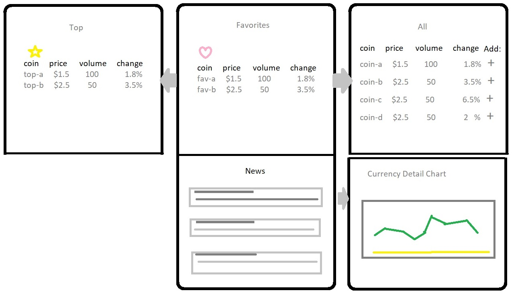

# Crypto Watcher

## Description
Quick access to top cryptocurrency rates. Explore news and more comprehensive list of currencies. Log in to save favorite coins for convenient updates.

## Design
Top carousel showing top coins. Swipe to see user favorites or list of all available coins. Bottom carousel showing news. Swipe to reveal coin detail chart.

### Project
Group Project at UCI Coding Bootcamp

#### Requirements:
- 2 APIs not previously used in class
- AJAX requests
- 1 library not previously used in class
- Mobile-first development
- Deploy to Firebase
  - Must have some persistent data
- User input validation
- 10 Minute presentation

#### APIs: 
- [CryptoCompare](https://min-api.cryptocompare.com/)
- [CNN News feed](https://newsapi.org/s/cnn-api)

#### Technologies: 
- [Bootstrap CSS library](https://getbootstrap.com/)
- [Accounting JS library](https://openexchangerates.github.io/accounting.js/)
- [Google Charts](https://google-developers.appspot.com/chart/interactive/docs/)

#### Contributors:
Adam Openbrier
Amin Mansouri
Armando Pensado
Daniel Amini

#### Tasks:
- [x] Create Repository on Github
- [ ] Create Firebase database
- [ ] Carousel Layout on HTML
- [ ] Input validation for user log-in information
- [ ] AJAX request for coin rates
- [ ] AJAX request for cryptocurrency news
- [ ] Format currency with Accounting.js
- [ ] Store user log-in and favorites in database

#### Additional Goal:
- [ ] Use Google Charts to graph coin details 
- [ ] Adjust UI for larger devices (tablet, desktop)